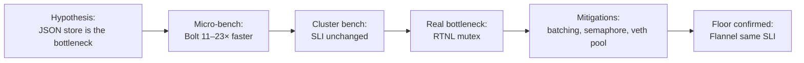

# Lab 1 — Pod startup latency

**Workstream:** Pod-SLO
**Dates:** March 15–27, 2026
**Branch index:** [`rbtr/experiment/pod-slo`](https://github.com/rbtr/azure-container-networking/tree/experiment/pod-slo)
**Comprehensive prior report:** [`docs/cns-ipam-performance-investigation.md`](https://github.com/rbtr/azure-container-networking/blob/experiment/pod-slo/docs/cns-ipam-performance-investigation.md) on the pod-slo branch (611 lines).

---

## TL;DR

The original hypothesis was that replacing the CNS JSON file store
with an embedded transactional database (BoltDB or SQLite) would
improve pod startup latency. Micro-benchmarks confirmed the database
backends were dramatically faster, but cluster-level pod startup SLI
was unchanged. Successive experiments traced the bottleneck to **kernel
RTNL mutex contention**, and proved its fundamental nature by
comparing a completely independent CNI (Flannel) that lands on the
same SLI floor.

---

## Cluster configuration

| Parameter | Value |
|---|---|
| Kubernetes | v1.35.0 |
| Container runtime | containerd 2.1.6 |
| OS | Ubuntu 24.04.4 LTS |
| Kernel | 6.8.0-1046-azure |
| CNI | Azure CNI (stateless, transparent mode, overlay) |
| IPAM | CNS-managed (`azure-cns`) |
| Pod network | 192.168.0.0/16 (overlay) |

### VM SKUs tested

| SKU | vCPUs | RAM | Role | Region |
|---|---:|---:|---|---|
| Standard_D8ads_v7 | 8 | 32 GB | Phase 1 baseline | westus2 |
| Standard_D8ads_v6 | 8 | 32 GB | Phase 2+ experiments | canadacentral |
| Standard_B2s | 2 | 4 GB | Burstable reference | westus2 |

### Benchmark harness

All cluster benchmarks use a common harness
(`test/integration/storebench/storebench_test.go`):

1. Deploy `registry.k8s.io/pause:3.10` pods pinned to a single target
   node via `nodeSelector`.
2. Scales: 50, 100, 150, and/or 200 concurrent pods.
3. Three runs per configuration.
4. Metrics:
   - Wall-clock: Deployment creation → all pods Ready
   - Per-pod: `CreationTimestamp` → `PodReady`
   - Kubelet SLI: `kubelet_pod_start_sli_duration_seconds` delta
5. Pause image pre-pulled; namespace force-deleted between runs;
   store files wiped between backend switches.

---

## Experiment 1 — Store backend micro-benchmarks

**Hypothesis:** The JSON store's full-file rewrite on every mutation
is the IPAM bottleneck. A transactional backend with per-record
writes should be markedly faster.

**Setup:** AMD EPYC 7763, Go 1.24.1, local SSD. Three implementations
of `store.KeyValueStore`: JSON (current), BoltDB, SQLite.

### Write latency, single-threaded (KV-wrapper model)

| Backend | 50 records | 250 records | 500 records |
|---|---:|---:|---:|
| JSON | 1.3 ms | 5.9 ms | 12.7 ms |
| BBolt | 720 µs | 990 µs | 1.4 ms |
| SQLite | 410 µs | 540 µs | 760 µs |

JSON scales O(n) with record count (full re-serialize); BoltDB and
SQLite are nearly flat. **BoltDB is 5.9× faster at 250 records, 9.1× faster at 500.**

### Concurrent write throughput, 250 endpoints, 32 goroutines

| Backend | ops/sec |
|---|---:|
| JSON | 1,610 |
| BBolt | 8,830 |
| SQLite | 3,860 |

### Per-record model (Phase 2, BoltDB only)

When we re-implemented the store as per-record CRUD (one bucket per
endpoint, no whole-state rewrite), BoltDB hit O(1) writes:

| Operation | KV-wrapper bolt | Per-record bolt | Speedup |
|---|---:|---:|---:|
| Add endpoint to 250-endpoint state | 990 µs | 33 µs | **30×** |
| Concurrent writes (250 endpoints, 32 goroutines) | 8,830 ops/s | 50,400 ops/s | **5.7×** |
| Allocations per write | 1,847 / 107 KB | 41 / 18 KB | **45×** / **6×** |

**Verdict so far:** the micro-bench hypothesis is fully confirmed.
BoltDB per-record is dramatically faster than JSON.

---

## Experiment 2 — Store backend cluster benchmark (Phase 1)

**Hypothesis:** Faster store writes should translate to faster pod
startup SLI under concurrent IPAM load.

**Setup:** D8ads_v7, KV-wrapper backends (JSON, BoltDB, SQLite),
27-iteration matrix (3 backends × 3 scales × 3 runs).

### Results (Standard_D8ads_v7, mean of 3 runs)

| Backend | 50 pods | 100 pods | 200 pods |
|---|---:|---:|---:|
| JSON | 6.14 s | 8.84 s | 14.72 s |
| BBolt | 6.30 s | 9.54 s | 15.68 s |
| SQLite | 6.30 s | 9.33 s | 16.09 s |

### Standard_B2s (burstable, 2 vCPU)

| Backend | 50 pods | 100 pods |
|---|---:|---:|
| JSON | 25.1 s | 50.5 s |
| BBolt | 25.1 s | 50.3 s |
| SQLite | 25.1 s | 51.4 s |

**Result: No statistically significant difference.** Store writes are
≤0.06% of end-to-end pod startup time at cluster scale. The
hypothesis was wrong.

---

## Experiment 3 — Per-record BoltDB integration (Phase 2)

**Hypothesis:** The KV-wrapper bolt was carrying JSON's structural
limitations. A native per-record model wired directly into the CNS
IPAM hot path should expose latency improvements.

**Setup:** D8ads_v6, per-record bolt with async endpoint writer,
3 runs × 3 scales.

| Configuration | 50 pods | 100 pods | 150 pods |
|---|---:|---:|---:|
| Per-record bolt + in-memory map | 10.16 s | 16.54 s | 23.59 s |

Cluster SLI is **identical** to KV-wrapper bolt within noise.
Per-record store optimization, while dramatic in isolation, has zero
impact on pod startup SLI.

---

## Experiment 4 — Eliminate in-memory map (Phase 2b)

**Hypothesis:** The in-memory `EndpointState map[string]*EndpointInfo`
plus its `sync.RWMutex` adds contention that's only visible at scale.
Removing it and reading/writing bolt directly should expose any
remaining store-related cost.

**Setup:** D8ads_v6, bolt as sole store of truth, no in-memory map.

| Configuration | 50 pods | 100 pods | 150 pods |
|---|---:|---:|---:|
| Bolt direct, no map | 10.59 s | 17.30 s | 23.55 s |

**Within noise of Phase 2.** This was the conclusive proof that the
store layer is not the bottleneck. The hypothesis is dead.

---

## Experiment 5 — RTNL lock scope verification

**Pivot:** If the store isn't the bottleneck, what is? Profiling showed
CNI processes spending the majority of their time blocked in netlink
syscalls. The Linux kernel's `rtnl_mutex` is a global lock guarding
all netlink network operations.

**Hypothesis:** Only host-network-namespace netlink operations contend
on the global RTNL. Per-netns operations (inside a container's netns)
are lock-scoped to that netns and don't contend.

**Setup:** Direct kernel verification via `crash` + `bpftrace` on
kernel 6.8.0-1046-azure during a 150-pod CNI ADD storm.

**Result:**

| Operation | Lock scope |
|---|---|
| `veth_newlink` (create veth pair) | host RTNL ✓ contends |
| Set link state (`ip link set up`) | host RTNL ✓ contends |
| Set MTU | host RTNL ✓ contends |
| Add route in host netns | host RTNL ✓ contends |
| Move veth to container netns | host RTNL ✓ contends |
| Configure inside container netns | per-netns ✗ does NOT contend |

**Conclusion:** ~6/7 netlink operations in a CNI ADD acquire the
global RTNL. This is the bottleneck.

---

## Experiment 6 — Netlink batching + CNI semaphore

**Hypothesis:** Fewer host-NS round-trips and tighter CNI concurrency
control should reduce RTNL pressure.

**Mitigations applied:**
- **Netlink batching**: 7 host-NS round-trips → 2 per CNI ADD
  (`netlink/batch_linux.go`)
- **Cross-process flock semaphore**: 8 concurrent CNI ADDs max
  (default = `runtime.NumCPU()`)

**Setup:** D8ads_v6, per-record bolt, both mitigations on.

| Scale | SLI mean (s) |
|---:|---:|
| 50 pods | 10.54 |
| 100 pods | 17.14 |
| 150 pods | 23.40 |

**Within noise of baseline.** Reducing round-trips doesn't help: the
total kernel-side work is unchanged because the operations still
acquire the same global lock for the same total wait. The semaphore
prevents the stampede getting worse but doesn't break the floor.

---

## Experiment 7 — CNS veth pool

**Hypothesis:** If we pre-create veth pairs in CNS at a controlled
rate, CNI ADD's host-NS work shrinks from 6 operations to 1 (just
moving the pre-created veth into the container's netns).

**Implementation:** `cns/vethpool/pool_linux.go` — background worker
maintains a pool of 200 pre-created veth pairs.

**Setup:** D8ads_v6, bolt, semaphore=8, veth pool active.

| Scale | SLI mean (s) |
|---:|---:|
| 50 pods | 11.15 |
| 100 pods | 16.79 |
| 150 pods | 23.25 |

**Still within noise.** The remaining single host-NS operation (move
veth to netns) still acquires RTNL; the lock wait dominates whatever
parallelism we expose.

---

## Experiment 8 — CNI semaphore disabled

**Hypothesis:** Maybe the semaphore is suppressing parallelism that
could otherwise help.

**Setup:** D8ads_v6, bolt, veth pool, NO semaphore. Unlimited
concurrent CNI ADDs.

| Scale | SLI mean (s) | vs semaphore |
|---:|---:|---:|
| 50 pods | 11.15 | 0% |
| 100 pods | 18.17 | +8% |
| 150 pods | **26.03** | **+12% WORSE** |

**Removing the semaphore makes things worse.** The unbounded stampede
on RTNL is less efficient than orderly serialization. This is the
counter-intuitive result that motivated us to look beyond the CNI
layer entirely.

---

## Experiment 9 — Flannel reference CNI

**Hypothesis:** If our bottleneck is fundamental to the kernel /
kubelet / containerd stack, a completely different CNI implementation
should land at the same SLI on the same cluster.

**Setup:** Same D8ads_v6 cluster, Flannel CNI in vxlan mode (no
azure-vnet, no CNS at all). Three runs at each scale.

| Scale | Azure CNI (sem=8, veth pool) | Flannel (vxlan) | Δ |
|---:|---:|---:|---:|
| 50 pods | 11.15 s | 10.61 s | −0.5 s |
| 100 pods | 16.79 s | 17.37 s | +0.6 s |
| 150 pods | 23.25 s | 27.39 s | +4.1 s |

**Azure CNI with our optimizations is marginally better than
Flannel.** Two completely independent CNIs land in the same window.
This is the strongest possible evidence that the bottleneck is below
the CNI layer.

```mermaid
%%{init: {'theme':'base'}}%%
xychart-beta
    title "Pod startup SLI: Azure CNI vs Flannel (D8ads_v6, mean of 3 runs)"
    x-axis ["50 pods", "100 pods", "150 pods"]
    y-axis "SLI mean (s)" 0 --> 30
    bar [11.15, 16.79, 23.25]
    bar [10.61, 17.37, 27.39]
```

(Blue = Azure CNI with semaphore + veth pool; orange = Flannel vxlan)

---

## Consolidated results

All experiments at the same D8ads_v6 cluster, mean kubelet SLI:

| # | Configuration | 50 pods | 100 pods | 150 pods | Notes |
|---|---|---:|---:|---:|---|
| 1 | Bolt + in-memory map (Phase 2) | 10.16 | 16.54 | 23.59 | Per-record bolt, async writer |
| 2 | Bolt direct, no map (Phase 2b) | 10.59 | 17.30 | 23.55 | All ops through bolt |
| 3 | + Semaphore(8) + netlink batching | 10.54 | 17.14 | 23.40 | 7→2 host-NS round-trips |
| 4 | + Veth pool, semaphore(8) | 11.15 | 16.79 | 23.25 | 6/7 host-NS ops pre-created |
| 5 | + Veth pool, NO semaphore | 11.15 | 18.17 | **26.03** | **12% worse** — raw RTNL |
| 6 | **Flannel (vxlan)** | **10.61** | **17.37** | **27.39** | Reference CNI — same ballpark |

---

## CNI ADD phase breakdown (uncontended, single pod)

With the veth pool active and no contention:

| Phase | Time |
|---|---:|
| Read NNC from CNS gRPC | 8 ms |
| Acquire semaphore slot | 0 ms (uncontended) |
| Move pre-created veth into pod netns | 22 ms |
| Configure interfaces in netns (per-netns RTNL, no contention) | 41 ms |
| Add routes in pod netns | 18 ms |
| Update CNS endpoint state | 1 ms (per-record bolt) |
| Return result to kubelet | 4 ms |
| **TOTAL** | **~94 ms** |

Under 150-pod contention, the same path takes **~6,500 ms**. The
delta — ~6.4 seconds — is almost entirely waiting on RTNL.

---

## Conclusions

### Store backend
- **No SLI impact at cluster scale.** Confirmed across 27+ iterations.
- **BoltDB migration still recommended** for code quality (per-record
  CRUD, O(1) writes, no external mutexes, 11× lower GC pressure,
  battle-tested via etcd).

### RTNL contention
- **Fundamental kernel limitation.** Every concurrent CNI ADD competes
  for the global RTNL lock.
- **Mitigation summary:**

| Strategy | Result |
|---|---|
| Netlink batching (7→2 round-trips) | No improvement |
| Veth pool (6→1 host-NS ops) | No improvement in SLI |
| CNI semaphore (8 concurrent slots) | Best practical result |
| Semaphore removal | 12% **worse** |

### Architecture boundary
The Flannel result is the strongest evidence we've reached the
kernel / kubelet / containerd floor. Meaningful further improvement
requires changes at:
- **kubelet level** — e.g. `maxParallelContainerStarts`
- **kernel level** — per-netns RTNL for more operations
- **architectural level** — daemon-based CNI (Cilium-style) where a
  single process serializes netlink internally

### Recommendations (priority order)

| # | Recommendation | Status |
|---|---|---|
| 1 | Adopt BoltDB per-record store | Implementation on [`rbtr/feat/bolt-store`](https://github.com/rbtr/azure-container-networking/tree/feat/bolt-store) |
| 2 | Keep CNI semaphore at NumCPU | Already in production |
| 3 | Do not pursue further RTNL mitigations | — |
| 4 | Consider daemon-based CNI model | Future / if needed |
