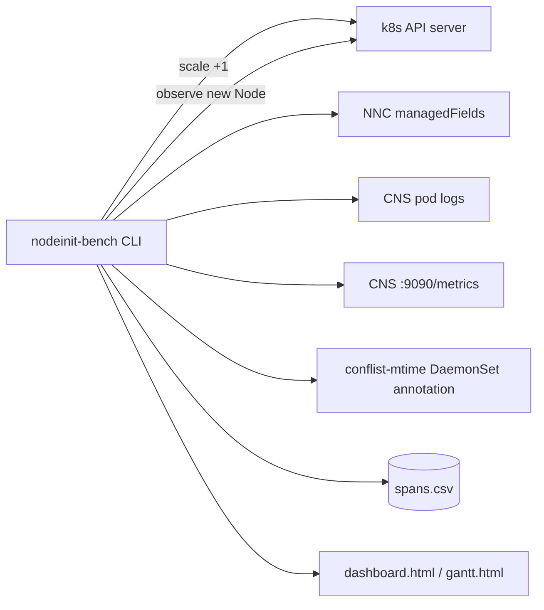
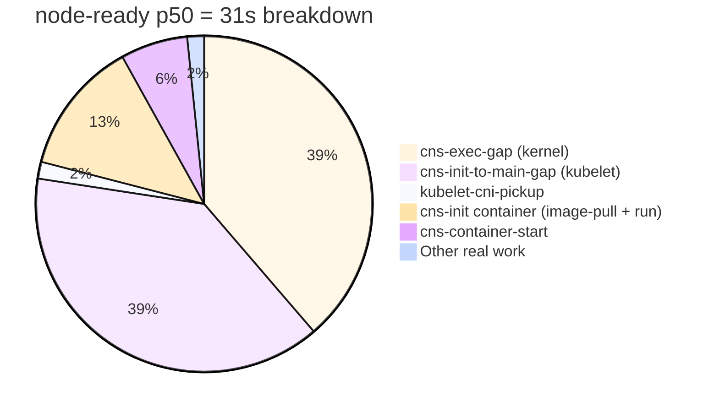
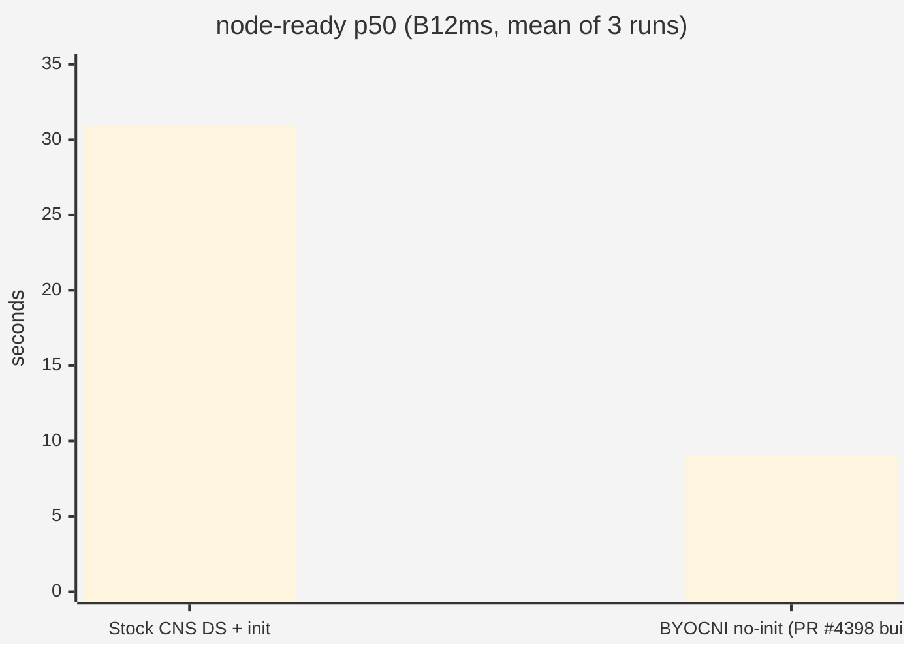

# Lab 2 — Node readiness

**Workstream:** Node-readiness
**Dates:** April 17 – May 19, 2026
**Branch:** [`rbtr/experiment/node-readiness`](https://github.com/rbtr/azure-container-networking/tree/experiment/node-readiness)
**Tool:** [`tools/nodeinit-bench/`](https://github.com/rbtr/azure-container-networking/tree/experiment/node-readiness/tools/nodeinit-bench)
**Prior writeups:** [`docs/node-readiness-investigation.md`](https://github.com/rbtr/azure-container-networking/blob/experiment/node-readiness/docs/node-readiness-investigation.md), [`docs/node-readiness-improvements.md`](https://github.com/rbtr/azure-container-networking/blob/experiment/node-readiness/docs/node-readiness-improvements.md), [`docs/static-pod-test-findings.md`](https://github.com/rbtr/azure-container-networking/blob/experiment/node-readiness/docs/static-pod-test-findings.md)

---

## Question

How fast can a new AKS node go from `Node.metadata.creationTimestamp`
(T0) to `Node Ready=True`? What's the breakdown by phase, and where
are the preventable gaps?

## TL;DR

For a stock Azure CNI Overlay (Cilium) AKS cluster on
`Standard_B12ms` nodes:

- **`node-ready` p50 ≈ 26 s** (8-run baseline)
- **Real work: ~5–6 s**. The remaining 20+ s is scheduler/runtime
  serialization — kubelet's pod-sync pipeline, kernel-level exec
  contention, and downstream cascade.
- The **single largest preventable gap is the init container**.
  Removing it (verified via embedded-CNI POC, [Lab 4](./04-embed-cni-poc.md))
  brings p50 to **9 s**.
- The static-pod path (T2.1) was **empirically blocked** on
  AKS-managed VMSSes via VM extensions — no extension publisher could
  inject a static-pod manifest at boot without breaking AKS's own
  bootstrap.

---

## Methodology

### nodeinit-bench tool

`tools/nodeinit-bench` is a Go CLI we built specifically for this
workstream. It scales an AKS nodepool, observes each new Node, and
emits per-Node spans by joining evidence from multiple sources:

Output: a Gantt-shaped span dataset rendered as CSV, Mermaid,
Plotly HTML, and Markdown summary. See
[Lab 3 — Bootstrap metrics](./03-bootstrap-metrics.md) for the
metrics-based observability that replaced log-parsing as the primary
source.

### Span definitions

| Span | Defined as |
|---|---|
| `vm-provision` | `az scale` invocation → Node `creationTimestamp` (upstream of CNS / DNC-RC) |
| `dnc-rc-create-nnc` | T0 → `CreatedNNC` event |
| `dnc-rc-create-nc` | `CreatingNC` → `UpdatedNC` events |
| `nnc-status-written` | from NNC `managedFields` |
| `cns-pod-schedule-latency` | NNC visible → CNS pod Scheduled |
| `cns-init-image-pull` | `azure-ipam` Pulling → Pulled |
| `cns-init-container-run` | init container Started → finishedAt |
| `cns-init-to-main-gap` | init `finishedAt` → main `Pulled` |
| `cns-image-pull` | `azure-cns` Pulling → Pulled |
| `cns-container-start` | Pulled → containerd Started |
| `cns-exec-gap` | containerd Started → first CNS log |
| `cns-process-bootstrap` | first log → "Reconciling initial CNS state" |
| `cns-nnc-ingest` | `RetrievedNNC` → `ReconcilingIPAM` |
| `cns-sync-host-nc-version` | NMAgent NC v0 confirmation latency |
| `cns-listener-ready` | containerd Started → "Started listening" |
| `cns-conflist-write` | containerd Started → newest `*.conflist` mtime |
| `kubelet-cni-pickup` | conflist mtime → Node Ready |
| `node-ready` | T0 → Node Ready=True |

---

## Experiment 1 — Stock-CNS baseline

**Hypothesis:** Establish a reproducible baseline on the standard AKS
managed Azure CNI Overlay cluster geometry.

**Setup:** `evanbaker-eastus2`, Azure CNI Overlay + Cilium dataplane,
`Standard_B12ms` × 2 nodes, K8s 1.33, Ubuntu 22.04, kernel 5.15.
Scale +1 node per run, 8 runs.

### Per-phase p50 (8 runs)

| Phase | p50 | p95 | Notes |
|---|---:|---:|---|
| `vm-provision` (T0 floor; not part of `node-ready`) | 95 s | 106 s | ARM + VMSS + OS boot + CSE + kubelet register |
| `dnc-rc-create-nnc` (T0 → CreatedNNC) | 0 s | 0 s | event-resolution floor, 1s buckets |
| `dnc-rc-create-nc` | 1 s | 1 s | event-resolution floor |
| `cns-pod-schedule-latency` | 0.8 s | 1.1 s | kube-scheduler |
| `cns-init-image-pull` | 3 s | 3 s | pull `azure-ipam` ~27 MB |
| `cns-init-container-run` | 1 s | 1 s | one-shot CNI binary install |
| **`cns-init-to-main-gap`** | **12 s** | **12.65 s** | **kubelet pod-sync pipeline backpressure** |
| `cns-image-pull` | 0 s | 0 s | preloaded in BYOCNI VHD |
| `cns-container-start` | 2 s | 4.5 s | containerd events |
| **`cns-exec-gap`** | **12.3 s** | **19.5 s** | **kernel/containerd serialization** |
| `cns-process-bootstrap` | 1.1 s | 1.1 s | actual CNS Go startup work |
| `cns-nnc-ingest` | <0.01 s | 0.001 s | instant |
| `cns-sync-host-nc-version` | 0.30 s | 0.43 s | initial NMA v0 confirmation |
| `cns-listener-ready` | 13.7 s | 20.8 s | = exec-gap + bootstrap + ~2 s |
| `cns-conflist-write` | 14.5 s | 21.1 s | gated by listener-ready |
| `kubelet-cni-pickup` | 0.5 s | 1 s | inferred (conflist mtime → Node Ready) |
| **`node-ready` (the OKR)** | **31 s** | **44 s** | T0 → Ready=True |

### Where the time goes

**Headline:** of 31 s p50, ~24 s is **serial scheduler/runtime
wait with nothing happening**:
- `cns-exec-gap` (12 s) is the kernel/containerd not exec'ing the Go
  binary under stampede
- `cns-init-to-main-gap` (12 s) is kubelet's pod-sync pipeline
  recognising init complete, running admission for main, calling
  containerd

CNS's actual code path runs in ~2 seconds. Everything else is
preventable.

---

## Experiment 2 — Static-pod test (T2.1)

**Hypothesis:** Deploying CNS as a static pod (manifest at
`/etc/kubernetes/manifests/`) instead of a DaemonSet would:
1. Bypass the kube-scheduler entirely
2. Avoid the apiserver round-trip
3. Start CNS earlier in node bootstrap, possibly before kubelet is
   ready to accept other pods

**Test plan:** 4 variants on a fresh BYOCNI cluster, 10 runs each:
- **A-pre**: DaemonSet CNS, image pre-baked in VHD
- **A-pull**: DaemonSet CNS, image forced to pull
- **B-pre**: Static pod CNS, image pre-baked in VHD
- **B-pull**: Static pod CNS, image forced to pull

### A variants completed (N = 20)

| Phase | A-pre p50 | A-pull p50 | delta |
|---|---:|---:|---:|
| `cns-image-pull` | 0 s | 23 s | +23 s |
| `cns-container-start` | 1 s | 6 s | +5 s |
| `cns-exec-gap` | **35.2 s** | **0.8 s** | **−34 s** |
| `cns-process-bootstrap` | 2.4 s | 0.1 s | −2 s |
| **node-ready** | **47 s** | **40 s** | **−7 s** |

**Counterintuitive result.** A-pull (forced pull) beats A-pre
(preloaded) by 7 s at p50. The image pull *absorbs* the
daemonset-stampede contention that otherwise materializes as
`cns-exec-gap`. Pre-baking the image isn't an unambiguous win — it
just shifts where the wait happens.

### B variants — empirically blocked

The B variants (static pod) require injecting the static-pod manifest
into `/etc/kubernetes/manifests/` at node boot, before kubelet starts.
On AKS-managed VMSSes the only customer-customizable surface is VM
Extensions. We tested four extension publishers:

| Extension | Result |
|---|---|
| `Microsoft.Azure.Extensions.CustomScript` v2.0 | **Replaces vmssCSE** (publisher.type collision) → kubelet never installed on new VMs |
| `Microsoft.CPlat.Core.RunCommandLinux` v1.0 | Coexists in VMSS extension list, but **new instance stuck in `Creating`** for 10+ min, eventually marked Failed |
| `Microsoft.CPlat.Core.RunCommandHandlerLinux` v1.3 | **Per-instance only**. Run Command v2 model; not a VMSS template-level extension |
| `Microsoft.OSTCExtensions.CustomScriptForLinux` v1.5 | Different publisher entirely, vmssCSE intact in VMSS model. **New instance still went `Creating → Deleting`** — vmAgent never reported, AKS reaped after ~13 min |

**Conclusion: extension-based injection of a static-pod manifest at
boot is not viable on AKS-managed VMSSes.** Across three publishers
and four extension types, every attempt either replaced vmssCSE
(publisher.type collision) or caused new-instance bootstrap to fail.

The remaining viable paths require:
- Custom AKS VHD with the manifest pre-baked, or
- Self-managed VMSS where we own provisioning

Both are substantially more setup than the extension path we
attempted. T2.1 (static pod) was set aside in favor of pursuing the
embedded-CNI direction (Lab 4), which delivers most of the same
savings without leaving the DaemonSet model.

---

## Experiment 3 — Mitigation candidates ranked

From [`docs/node-readiness-improvements.md`](https://github.com/rbtr/azure-container-networking/blob/experiment/node-readiness/docs/node-readiness-improvements.md),
the catalog of mitigations ranked by impact × feasibility:

### Tier 1 — Cheap wins, no rearchitecture

| Strategy | Estimated savings | Effort |
|---|---:|---|
| Pre-pull CNS image into AKS VHD | up to −5 s (`cns-image-pull`) | Ops only |
| Bake `azure-vnet`/`azure-ipam` into AKS VHD | −6 to −10 s (eliminates init container) | Ops only |
| Tighter CNS bootstrap (skip telemetry init for first NNC) | ~1 s | Small CNS code change |

### Tier 2 — Architectural changes

| Strategy | Estimated savings | Effort |
|---|---|---|
| **T2.1 — CNS as static pod** | ~5–10 s | Blocked on AKS VMSS extensions (see Experiment 2) |
| **T2.2 — CNS as systemd unit** | Could approach sub-3 s `node-ready` | Largest change; CNS leaves the pod model |
| **Embed CNI binaries in CNS image** | −6 to −10 s | POC complete ([Lab 4](./04-embed-cni-poc.md)) |

### Tier 3 — Foundational

| Strategy | Notes |
|---|---|
| Custom AKS VHD with CNS pre-baked + manifest | Production-real path to sub-5 s |
| Kernel / containerd / kubelet upstream tuning | Out of scope for this workstream |

---

## Experiment 4 — Fresh baseline on BYOCNI (no init container)

**2026-05-15:** Fresh BYOCNI overlay cluster on `Standard_B12ms`,
CNS deployed via `test-staticpod/cns-daemonset-A-pre.yaml` (no init
container — relies on the BYOCNI VHD shipping upstream CNI plugins
like `bridge`/`host-local`, with CNS generating the conflist itself).
Image: PR #4398 build with bootstrap metrics enabled.

### Results (3 runs)

| Phase | p50 |
|---|---:|
| `vm-provision` (T0 floor; not in node-ready) | 80 s |
| `cns-pod-schedule-latency` | 0.6 s |
| `cns-init-image-pull` | n/a |
| `cns-init-container-run` | n/a |
| `cns-init-to-main-gap` | n/a |
| `cns-image-pull` | 5 s |
| `cns-container-start` | 0 s |
| `cns-exec-gap` | 0.6 s |
| `cns-process-bootstrap` | 0.3 s |
| `cns-state-restored` | 35 ms |
| `cns-first-nnc-received` | 336 ms |
| `cns-initial-ipam-reconciled` | 354 ms |
| `cns-listener-ready` | 366 ms |
| `cns-first-nc-programmed` | 1.41 s |
| `cns-conflist-write` | 1.41 s |
| `kubelet-cni-pickup` | 0 s |
| **node-ready** | **9 s** |

The sub-second precision on the CNS-bootstrap spans comes from PR
#4398 metrics (Lab 3). For the first time we can see that CNS's own
work — from process start to listener ready — is **under 400 ms**.
The remaining 8 s of `node-ready` is image pull + scheduler latency +
kubelet pickup.

> ⚠️ **This comparison conflates three variables** (cluster type,
> CNS image version, init container). The [rigorous A/B in Lab 4](./04-embed-cni-poc.md#experiment--rigorous-init-container-ab)
> isolates the init container alone and measures **2.5 s p50** as
> the true cost. The remaining ~14 s of the 22 s gap above is
> cluster type and CNS image version (PR #4398 dramatically
> accelerates CNS-internal bootstrap, see [Lab 3](./03-bootstrap-metrics.md)).

---

## Conclusions

1. **The init container imposes a measurable serial waterfall** on
   `node-ready` — **2.5 s p50** on a controlled A/B
   ([Lab 4](./04-embed-cni-poc.md)); larger gap against the real
   `cni-dropgz` separate-image init container. Removing it (via
   embedded-CNI subcommand) is a real but modest improvement; the
   bigger headline numbers in earlier comparisons came from
   simultaneously upgrading the CNS image to PR #4398 and switching
   cluster types.
2. **Static-pod (T2.1) is the cleanest architectural fix but is
   blocked** on the AKS VMSS extension surface. Requires custom VHD
   bake-in to be testable.
3. **CNS itself is fast** (sub-400 ms cold-start bootstrap). Future
   gains live in scheduler / image-pull / kubelet domain, not CNS
   code.
4. **PR #4398 changed the diagnostic baseline.** With sub-second
   precision on every phase boundary, future regressions are
   detectable from `/metrics` directly. See [Lab 3](./03-bootstrap-metrics.md).

## Recommendations (priority order)

| # | Recommendation | Lab |
|---|---|---|
| 1 | Land PR #4398 (bootstrap metrics) | [Lab 3](./03-bootstrap-metrics.md) |
| 2 | Embed CNI binaries in CNS image, drop init container | [Lab 4](./04-embed-cni-poc.md) |
| 3 | Pre-pull CNS image into AKS VHD | (out of scope this workstream) |
| 4 | T2.2 (systemd unit) for sub-3 s ceiling — long-term | (out of scope this workstream) |
