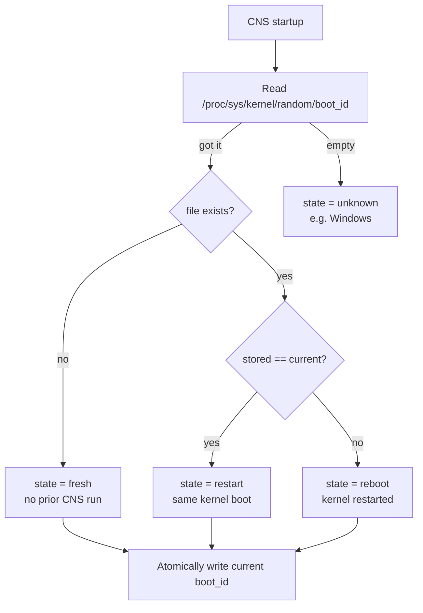

# Lab 3 — CNS bootstrap metrics (PR #4398)

**Workstream:** Node-readiness (observability prerequisite)
**Date:** May 8, 2026
**Branch:** [`Azure:feat/cns-bootstrap-metrics`](https://github.com/Azure/azure-container-networking/tree/feat/cns-bootstrap-metrics)
**PR:** [Azure/azure-container-networking#4398](https://github.com/Azure/azure-container-networking/pull/4398) (**OPEN**)
**Commit:** `986155187` — 12 files, +832/-4

---

## Hypothesis

The `nodeinit-bench` tool ([Lab 2](./02-node-readiness.md)) was
reconstructing CNS startup-phase boundaries by parsing CNS logs and
Kubernetes pod events. This was fragile (log format changes break
the parser) and lossy (1 s event resolution floor). A small,
durable set of Prometheus metrics emitted at known bootstrap
boundaries would:

1. Give the bench tool sub-second precision without log parsing
2. Make node-init time observable from any production dashboard
3. Enable fleet-wide SLO tracking (via `histogram_quantile()`)
4. Provide an alerting surface for NNC stream staleness

---

## What was added — 16 new metrics

All under the `cns_` prefix with bounded label sets:

### Identity / context

| Metric | Type | Labels |
|---|---|---|
| `cns_build_info` | gauge=1 | `version`, `goversion`, `os` |
| `cns_start_time_seconds` | gauge | — |
| `cns_mode_info` | gauge=1 | `channel_mode`, `ipam_v2`, `swift_v2`, `manage_endpoint_state`, `dual_stack` |
| `cns_boot_state` | gauge=1 | `state ∈ {fresh, reboot, restart, unknown}` |

`cns_boot_state` distinguishes three meaningful node-lifecycle
states by comparing the kernel `boot_id`
(`/proc/sys/kernel/random/boot_id`) to a value persisted at
`/var/lib/azure-network/.cns_boot_id`:



### Bootstrap event-timestamp gauges

Each set once via `sync.Once` to the Unix timestamp of the event:

| Metric | Set when |
|---|---|
| `cns_state_restored_seconds` | `restoreState()` returns |
| `cns_first_nnc_received_seconds` | First NNC reconcile |
| `cns_initial_ipam_reconciled_seconds` | Initial IPAM reconcile succeeds |
| `cns_first_nc_programmed_seconds` | `syncHostNCVersion` confirms first NC at desired version |
| `cns_http_listener_ready_seconds` | HTTP REST listener bound |
| `cns_conflist_written_seconds` | CNI conflist atomic rename complete |
| `cns_ready_to_assign_seconds` | Mode-aware predicate satisfied |

### Mode-aware ready-to-assign

`cns_ready_to_assign_seconds` requires different predicates depending
on which CNS mode is active:

- **CRD** (Swift / Overlay): HTTP listener up AND ≥1 IP per *required*
  family in `Available` state (dual-stack needs both v4 and v6)
- **NodeSubnet** (`AzureHost`): HTTP listener up AND
  `InitializeNodeSubnet` returned successfully
- **SwiftV2**: defers to CRD predicate (v1 limitation)

A central recorder
([`cns/metric/ready_to_assign.go`](https://github.com/Azure/azure-container-networking/blob/feat/cns-bootstrap-metrics/cns/metric/ready_to_assign.go))
tracks the inputs and fires the gauge exactly once when the predicate
becomes true.

### Fleet aggregation

| Metric | Type | Notes |
|---|---|---|
| `cns_time_to_event_seconds{event}` | histogram | Process-relative time to each event. Buckets: `[0.5, 1, 2, 5, 10, 20, 30, 60, 120, 300]`. One observation per event per process. |

This is what lets fleet-wide PromQL like
`histogram_quantile(0.95, sum by (le) (rate(cns_time_to_event_seconds_bucket{event="ready_to_assign"}[1h])))`
compute "what's the p95 time-to-ready across my fleet?"

### NNC reconciler health

| Metric | Type | Labels |
|---|---|---|
| `cns_nnc_reconcile_duration_seconds` | histogram | — |
| `cns_nnc_reconcile_total` | counter | `result ∈ {success, error, requeue}` |
| `cns_nnc_last_received_seconds` | gauge | Updated every reconcile |
| `cns_nnc_last_successful_reconcile_seconds` | gauge | Updated on success only |

The pair of `last_received` / `last_successful` gauges is the
alerting surface: "no successful NNC reconcile in 10 minutes" is a
real on-call page.

---

## Design notes

### Mode-aware predicate, not "≥1 IP and listener up" globally

The rubber-duck critique (during planning) caught that the simple
"listener up + ≥1 Available IP" definition would misfire in
dual-stack (could mark ready with only IPv4 available) and SwiftV2
(different IP-state semantics). The mode-aware predicate is
documented in
[`cns/metric/ready_to_assign.go`](https://github.com/Azure/azure-container-networking/blob/feat/cns-bootstrap-metrics/cns/metric/ready_to_assign.go)
with explicit per-mode cases.

### Per-event timestamps + histogram, not chained phases

An earlier design used a chained-phase histogram (`listener →
first_nnc` etc.) but CRD mode actually runs `InitializeCRDState`
*before* the HTTP server starts, so chained phases would go negative.
Per-event timestamps + process-relative durations via a single
histogram handle the mode variance cleanly.

### `cns_boot_state{state}` rather than a label on every event gauge

Same idiomatic pattern as `cns_mode_info` and upstream
`kube_pod_status_phase`. Avoids series multiplication. PromQL joins
work cleanly:

```promql
cns_ready_to_assign_seconds
  and on(instance) cns_boot_state{state="fresh"} == 1
```

### Conflist timestamp set after `Close()`, not `Generate()`

The atomic writer's rename happens in `Close()`. Setting the metric
after `Generate()` only would claim file visibility before the file
exists at its final path.

### Series budget

| Group | Series |
|---|---:|
| Identity (`build_info`, `start_time`, `mode_info`) | 3 |
| `boot_state` (4 label values pre-registered) | 4 |
| 7 event-timestamp gauges | 7 |
| `cns_time_to_event_seconds` (7 events × 12 bucket-series) | 84 |
| `cns_nnc_reconcile_duration_seconds` (17 bucket-series) | 17 |
| `cns_nnc_reconcile_total{result}` (3 results) | 3 |
| 2 NNC staleness gauges | 2 |
| **Total** | **120** |

For context: existing CNS surface is ~200–500 series per node already.
+120 is comfortable.

---

## Verification

### Tests
12 new tests in `cns/metric/bootstrap_test.go`:
- 3-way boot-state classification (fresh / reboot / restart)
- Boot-state classifier handles unreadable `/proc` as `unknown`
- CRD predicate (no listener, no IPs, single-stack v4-only,
  dual-stack v4-only-rejected, dual-stack both-allowed,
  single-stack v6-only-rejected)
- NodeSubnet predicate
- Ready-to-assign fires exactly once
- Build-info / mode setters smoke
- All 16 metrics end up in the controller-runtime registry
- `ObserveNNCReconcile(success)` advances both staleness gauges
- `ObserveNNCReconcile(error)` advances received only
- `observeTimeToEvent` skips when start time is unset
- `observeTimeToEvent` clamps negative observations to zero

All existing tests in `cns/metric`, `cns/restserver`,
`cns/restserver/v2`, `cns/kubecontroller/nodenetworkconfig` still
pass.

### Live cluster verification (2026-05-15)

Image `acnpublic.azurecr.io/azure-cns:v0.0.4-6-bootstrap-metrics-20260515-1427`
deployed to fresh BYOCNI overlay cluster. Sample `/metrics` output:

```
cns_boot_state{state="fresh"} 1
cns_boot_state{state="reboot"} 0
cns_boot_state{state="restart"} 0
cns_boot_state{state="unknown"} 0
cns_build_info{goversion="go1.24.13",os="linux",version="v0.0.4-6-bootstrap-metrics-20260515-1427"} 1
cns_conflist_written_seconds 1.7788565244861445e+09
cns_first_nc_programmed_seconds 1.7788565244858935e+09
cns_first_nnc_received_seconds 1.778856523421299e+09
cns_http_listener_ready_seconds 1.7788565234507856e+09
cns_initial_ipam_reconciled_seconds 1.778856523439403e+09
cns_mode_info{channel_mode="CRD",dual_stack="false",ipam_v2="true",manage_endpoint_state="true",swift_v2="false"} 1
cns_nnc_last_received_seconds 1.778856835251792e+09
cns_nnc_last_successful_reconcile_seconds 1.778856835251792e+09
cns_nnc_reconcile_duration_seconds_bucket{le="0.001"} 0
...
```

All 16 metrics populated correctly.

### Metric-derived span data (post-deploy)

The same cluster's first 3 scale-up runs, observed via
nodeinit-bench scraping the new metrics:

| span | source | p50 |
|---|---|---:|
| `cns-state-restored` | `cns_state_restored_seconds` | 35 ms |
| `cns-first-nnc-received` | `cns_first_nnc_received_seconds` | 336 ms |
| `cns-initial-ipam-reconciled` | `cns_initial_ipam_reconciled_seconds` | 354 ms |
| `cns-listener-ready` | `cns_http_listener_ready_seconds` | 366 ms |
| `cns-first-nc-programmed` | `cns_first_nc_programmed_seconds` | 1.41 s |
| `cns-conflist-write` | `cns_conflist_written_seconds` | 1.41 s |

**This is the first measurement of CNS's startup at sub-second
precision.** Previously the bench was floor-limited at 1 s by k8s
event resolution. With metrics, we see CNS's actual work taking
under 400 ms cold-start.

---

## Operational impact

The metrics make the following dashboard queries trivial:

```promql
# Time-to-ready p95 across the fleet
histogram_quantile(0.95,
  sum by (le) (rate(cns_time_to_event_seconds_bucket{event="ready_to_assign"}[1h])))

# NNC staleness alert (no successful reconcile in 10 min)
(time() - cns_nnc_last_successful_reconcile_seconds) > 600

# Fleet split by boot state
sum by (state) (cns_boot_state)

# Distribution of NNC reconcile durations
histogram_quantile(0.99,
  sum by (le) (rate(cns_nnc_reconcile_duration_seconds_bucket[5m])))
```

The `nodeinit-bench` tool was updated
([commit `f5dd7962a`](https://github.com/rbtr/azure-container-networking/commit/f5dd7962a))
to consume these gauges as the primary source for bootstrap phase
boundaries, with log parsing kept as a fallback for older CNS images.

---

## Conclusions

1. **PR #4398 unblocks all downstream observability work.** The
   nodeinit-bench tool no longer needs to parse logs to get sub-second
   precision on CNS startup phases.
2. **Mode-aware ready-to-assign** is the design decision that makes
   these metrics correct across CRD / NodeSubnet / SwiftV2. A
   simpler "listener up + IP available" predicate would silently
   misfire on dual-stack and SwiftV2.
3. **3-way `cns_boot_state`** classifies the relevant node-lifecycle
   states (fresh / reboot / restart) using a small persistent file +
   the kernel boot_id. Works without depending on tmpfs vs
   persistent-mount semantics that differ between DaemonSet,
   static-pod, and systemd deployment models.
4. **Series budget +120** is comfortably within the existing
   CNS-metrics footprint.

### Status

PR #4398 is **open** on `Azure/azure-container-networking`. Awaiting
review.
