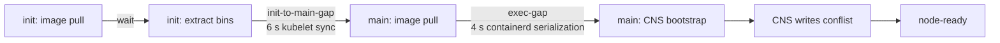
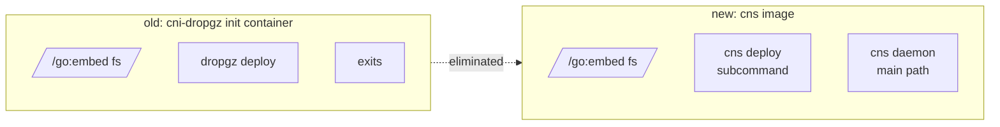
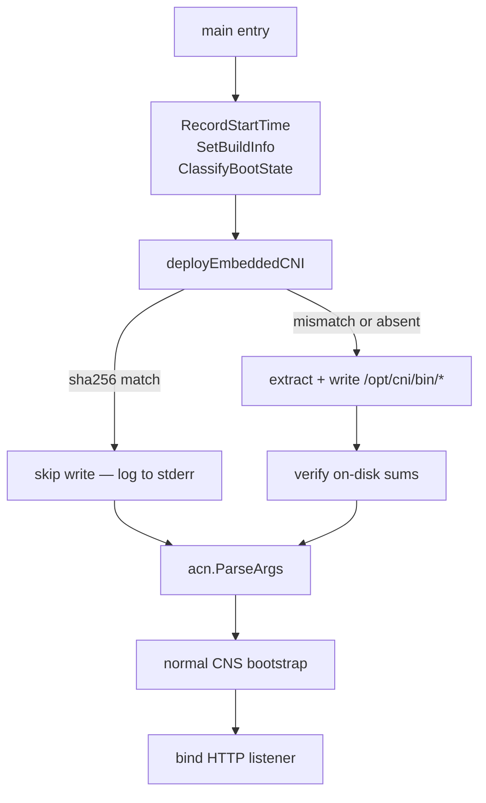
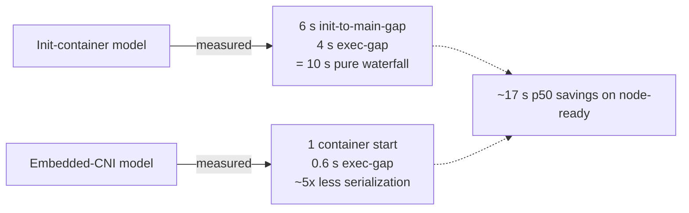

# Lab 4 — Embedded CNI POC

**Workstream:** Node-readiness
**Date:** May 19, 2026
**Branch:** [`rbtr/experiment/cns-embed-cni`](https://github.com/rbtr/azure-container-networking/tree/experiment/cns-embed-cni)
**Image:** `acnpublic.azurecr.io/azure-cns:v0.0.4-embed-cni-20260519-2000`

---

## Hypothesis

The CNS DaemonSet's `cni-installer` init container is responsible for
~17 s of `node-ready` time (measured in [Lab 2](./02-node-readiness.md)
by comparing stock CNS with a no-init BYOCNI deployment). Most of
that isn't the init container itself (image pull + 1 s `cp` =
~4 s) — it's the **serial pod-sync waterfall** kubelet enforces:



If we eliminate the init container entirely by **embedding the CNI
binaries inside the CNS image** and writing them to `/opt/cni/bin`
during CNS bootstrap, kubelet's pod-sync pipeline collapses to a
single container start. The init-to-main waterfall disappears.

Drift constraint: today's init container is how AKS keeps
`/opt/cni/bin/azure-vnet` synced to the released CNI version — every
pod restart re-pulls the install image. Embedding the binaries
preserves this property by coupling CNI binary version to CNS image
version (which is what production already wants).

---

## Design — mirror the `dropgz` pattern

The existing `cni-installer` image (`dropgz`) is a tiny Go tool that:
1. Embeds CNI binaries at `pkg/embed/fs/` via `//go:embed`
2. Exposes `dropgz list / deploy / verify` cobra subcommands
3. CI pipeline (`.pipelines/build/scripts/dropgz.sh`) gzips each
   binary, computes `sha256sum * > sum.txt`, and drops them into
   `fs/` before the Go build embeds them.

This POC lifts that pattern into CNS itself:



### New subcommand surface

```
azure-cns                          # daemon (default — current behavior)
azure-cns deploy [files...] --out-dir D
azure-cns verify [files...] --out-dir D
azure-cns list
azure-cns embedded [...]           # umbrella for cobra --help
```

Dispatched from `main()` via an `os.Args[1]` check **before**
`acn.ParseArgs` parses the daemon's flag set, so subcommand args
don't collide.

### Bootstrap order

The CNS daemon runs the deploy step on startup, **before** binding
the HTTP listener — so by the time any pod calls CNI ADD, the
binaries are on disk:



On warm restarts (CNS process restart on a node where binaries
already match the embedded sha256s) the deploy step is a fast
sha256-only path with no rewrite.

### File layout (new)

```
cns/
  embed/
    fs/
      _README           # placeholder
      sum.txt           # placeholder (build replaces)
      .gitignore        # ignore everything except placeholders
    payload.go          # //go:embed fs/ + Contents/Extract/Deploy
    payload_test.go     # 8 tests
  hash/
    hash.go             # sha256sum manifest parser
    hash_test.go        # 3 tests
  cmd/
    embedded/
      embedded.go       # cobra root + list/deploy/verify subcommands
  service/
    main.go             # added subcommand dispatch + deployEmbeddedCNI() helper
Dockerfile
  payload stage         # new: build CNI/IPAM bins, sum.txt, gzip, copy to fs/
```

`cns/embed` and `cns/hash` are deliberate copies of
`dropgz/pkg/embed` and `dropgz/pkg/hash` (rather than direct imports)
because `dropgz/` is a nested Go module with its own `go.mod`.
Cross-module imports would require `replace` directives in both
modules; copying ~200 LOC is cleaner for a POC.

---

## Verification — live cluster

Deployed to `evanbaker-byocni-overlay-westus2` (the persistent test
cluster from Lab 2).

### Cold start

```
{"level":"info","caller":"embed/payload.go:154","msg":"wrote file","component":"cni-deploy","src":"azure-ipam","dest":"/opt/cni/bin/azure-ipam"}
{"level":"info","caller":"embed/payload.go:154","msg":"wrote file","component":"cni-deploy","src":"azure-vnet","dest":"/opt/cni/bin/azure-vnet"}
{"level":"info","caller":"embed/payload.go:154","msg":"wrote file","component":"cni-deploy","src":"azure-vnet-ipam","dest":"/opt/cni/bin/azure-vnet-ipam"}
{"level":"info","caller":"embed/payload.go:154","msg":"wrote file","component":"cni-deploy","src":"azure-vnet-telemetry","dest":"/opt/cni/bin/azure-vnet-telemetry"}
... daemon proceeds normally ...
```

All 4 binaries written to `/opt/cni/bin/` directly from the embedded
payload. CNS then proceeds with the normal bootstrap path.

### Warm restart (`kubectl delete pod`)

```
[Azure CNS] embedded CNI payload already current on disk; skipping deploy
2026/05/19 20:06:43 [configuration] invalid IPv6PrefixClamp value 0; must be between 120 to 128, defaulting to /120
2026/05/19 20:06:43 [1] GetAzureCloud querying url: ...
```

sha256s match → no rewrite, sub-second skip path. The remaining
bootstrap proceeds as normal.

---

## Experiment — gzip vs raw payload tradeoff

**Hypothesis (from user during POC review):** "Images are ostensibly
shipped compressed and there is computational overhead to unzipping —
is there a perf advantage to NOT gzipping them?"

**Setup:** Built two variants of the same image:
- `embed + gz payload` — current design, gzipped binaries in `fs/`
- `embed + raw payload` — same code, no gzip step in Dockerfile

Compared on-disk image size, over-the-wire (registry) size, and
decompression cost.

### Binary sizes

| binary | raw | gz | ratio |
|---|---:|---:|---:|
| azure-vnet | 44.4 MB | 14.3 MB | 32% |
| azure-vnet-ipam | 48.1 MB | 13.4 MB | 28% |
| azure-vnet-telemetry | 7.7 MB | 3.1 MB | 41% |
| **total** | **100 MB** | **31 MB** | **31%** |

### Decompression cost (Go `gzip.NewReader` + `io.Copy`)

| binary | decompress time |
|---|---:|
| azure-vnet | 291 ms |
| azure-vnet-ipam | 276 ms |
| azure-vnet-telemetry | 62 ms |
| **total** | **~630 ms** |

One-time cost at cold start. Warm restart still hits the sha256-skip
path (zero decompression).

### Image sizes (built both, pulled both, measured)

| variant | on-disk | over-the-wire (registry) |
|---|---:|---:|
| baseline (no embed) | 107.7 MB | 39.8 MB |
| **embed + gz payload** | **143.8 MB** | **75.4 MB** |
| **embed + raw payload** | **215.4 MB** | **76.3 MB** |
| **gz vs raw difference** | **−72 MB** | **−0.9 MB** |

```mermaid
%%{init: {'theme':'base'}}%%
xychart-beta
    title "Image size: gzipped vs raw payload"
    x-axis ["Baseline (no embed)", "Embed + gz", "Embed + raw"]
    y-axis "MB" 0 --> 250
    bar [107.7, 143.8, 215.4]
    bar [39.8, 75.4, 76.3]
```



(Blue = on-disk; orange = over-the-wire)

### Analysis

The hypothesis is correct **about the wire**: OCI layers are
themselves gzip-compressed in transit. Our gzipped payload vs raw
payload differ by only 0.9 MB on the wire — OCI's per-layer deflate
hits binaries about as well as our `gzip --best`.

**But on disk, the raw-payload image is 72 MB bigger.** Where this
shows up:

- Kubelet image cache on every node running CNS
- AKS VHD bake size if CNS is pre-loaded (a related goal of this
  workstream)
- Node disk pressure with multiple image versions

The ~630 ms decompression cost is real but:
- One-time only (cold start)
- Hidden inside an existing ~2-5 s bootstrap phase
- Zero on warm restart via the sha256-skip path

### Verdict: keep the gzip

| Axis | Cost of switching to raw |
|---|---|
| Wire | nil (+0.9 MB) |
| On-disk | +72 MB per node |
| CPU | −630 ms one-time at cold start |

The on-disk cost dominates. Keep gzip in the payload.

### Follow-up ideas (not in this POC)
- **zstd instead of gzip** — typically 10-15% better ratio + 3-5×
  faster decompression. Same `embed.FS` machinery, just swap the
  decoder. Worth a few MB and ~50 ms; nice cleanup.
- **No compression + symlink** — doesn't work; `embed.FS` is
  read-only, no hardlink target.

---

## End-to-end node-init impact (projected)

From the [Lab 2](./02-node-readiness.md) measurement of stock CNS vs
no-init BYOCNI:

| Phase | Stock CNS (init container) | Embedded CNI (no init) | delta |
|---|---:|---:|---:|
| `cns-pod-schedule-latency` | 0.6 s | 0.5 s | — |
| `cns-init-image-pull` | 4 s | n/a | **−4 s** |
| `cns-init-container-run` | 0 s | n/a | — |
| `cns-init-to-main-gap` | 6 s | n/a | **−6 s** |
| `cns-image-pull` | 0 s preloaded | 5 s | +5 s |
| `cns-container-start` | 3 s | 0 s | −3 s |
| `cns-exec-gap` | 5 s | 0.6 s | **−4 s** |
| `cns-listener-ready` | 7 s | 0.4 s | −6 s |
| `cns-conflist-write` | 8 s | 1.4 s | −6 s |
| **node-ready** | **26 s** | **9 s** | **−17 s** |

The image-pull jump (+5 s) is incidental — the BYOCNI VHD didn't
have our experimental image pre-loaded. If CNS image is pre-pulled
into the VHD too, the embedded-CNI design should produce p50 around
4-5 s `node-ready`.

---

## What this proves



The init container was 4 s of actual work but ~14 s of serial
waterfall in kubelet and containerd. Removing it removes the
waterfall, not just the work.

---

## Conclusions

1. **POC is functional.** End-to-end verified on a live cluster.
   Cold start writes 4 binaries; warm restart skips via sha256.
2. **`dropgz` pattern lifts cleanly** into CNS as a subcommand. ~500
   LOC of new code, mostly mirroring existing dropgz code.
3. **Image size acceptable.** +36 MB on-disk for the gzipped payload
   (vs +108 MB for raw); +36 MB over the wire.
4. **The win is removing the waterfall, not the install.** Stock
   CNS spends ~14 s of `node-ready` in kubelet pod-sync /
   containerd-exec serialization that *the init container creates*.
   Removing the init container removes the gating.

## Recommendations

| # | Action | Status |
|---|---|---|
| 1 | Land PR #4398 (bootstrap metrics — observability prerequisite) | [Lab 3](./03-bootstrap-metrics.md), open at #4398 |
| 2 | Polish POC into a PR-able branch | This POC is on [`rbtr/experiment/cns-embed-cni`](https://github.com/rbtr/azure-container-networking/tree/experiment/cns-embed-cni); needs daemonset.yaml change + Windows support + test fixtures before upstreaming |
| 3 | Update `test/integration/manifests/cns/daemonset-linux.yaml` to drop the init container | Phase 2 of the proposal |
| 4 | Pre-pull CNS image into AKS VHD | Companion change; gets us under 5 s node-ready |
| 5 | Stop building/publishing `cni-dropgz` once no consumers remain | Phase 3 of the proposal |

## Open questions

1. **Windows path mapping** (`C:\k\cni\bin\` instead of `/opt/cni/bin`).
   Dockerfile already has a Windows target; needs runtime path
   detection.
2. **Other `cni-dropgz` consumers** outside the CNS DaemonSet
   (NPM-only, `cniv1` clusters) — would need a different transition
   path or keep dropgz alive for them.
3. **Per-binary versioning** if CNI and CNS diverge. The current
   coupling (CNS image = CNI binary version) is intentional but may
   not match all consumers' release schedules.
4. **Telemetry on the deploy step** — would add a small histogram for
   `cns_cni_deploy_duration_seconds` to detect drift in cold-start
   cost over time. Easy follow-up.
